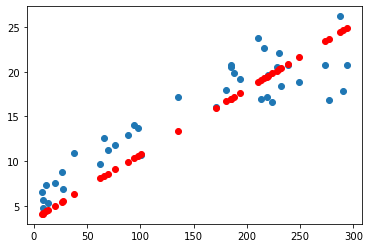

#  변수 축소 
## 주성분분석(PCA)
<br>
<b>가.</b> 주성분분석의 개념<br>

* 주성분분석이란 데이터에 여러 변수들이 있을 때, 서로 상관성이 높은 변수들의 선형결합으로 이루어진 "주성분"이라는 새로운 변수를 만들어 변수들을 요약하고 축소하는 기법 
<br>
예를 들어서 변수들중에서 10개를 주성분으로 했을때 이게 전체의 몇퍼센트를 설명하는지 
<br>
<br>
<b>나.</b>  파이썬을 이용한 주성분 분석
* 변수간의 스케일이 차이가 나면 스케일 큰 변수가 주성분에 영향을 많이 주기 때문에 주성분 분석 전에 변수를 <b>표준화나 
  정규화</b>시켜주는 것이 좋다. 데이터 표준화에 사용하는 함수는 StandardScaler()이다. 
* 파이썬에서 주성분분석을 수행할 수 있는 기본적인 함수는 <b>sklearn의 PCA함수</b>이다. 
* pca.explained_variance_ratio_를 통해서 또는 Scree Plot으로 주성분의 설명력을 확인 할 수 있다. 
* PCA함수는 공분산행렬의 고유벡터를 구하는 방법을 사용한다. 


## 차원을 줄여야 하는 이유 
* 데이터 용량이 커질수록 불필요한 샘플 증가 현상이 일어남 
* 과도한 정보를 훈련시키면 부정확하고 잘못된 모델이 탄생할 가능성이 증가함 
<br>
<br>
1차원에 한점에 5개가 모여있는거 1/10 <br>
2차원에서 5개가 퍼져서 y로 표기 5/100<br>
3차원 x,y,z 공간으로 존재 5/1000
<br>
<br>
빈 공간이 많을수록 분산을 설명하기가 어려움<br>
==> 차원 축소로 해결하는거 <br> 
<요인회전> 축을 이동시켜서 모든 요인들이 분산이 적도록 만듬. <br>
pca.explained_variance_ratio_을 통해서 몇 차원을 쓸지 정함 


## 차원 축소PCA 예시 

(1)수치형 데이터만 추출<br>
(2)수치형 변수 정규화<br>
(3)주성분 개수 정함(데이터 갯수만큼 넣음)<br>
(4)fit시킴 <br>
(5)pca.explained_variance_ratio_ 분산설명력의 비율<br>


```python
import pandas as pd
```


```python
iris_data=pd.read_csv('D:/anaconda/00.studying/data/iris.csv')
iris_data.head(3)
```


<div>
<style scoped>
    .dataframe tbody tr th:only-of-type {
        vertical-align: middle;
    }

    .dataframe tbody tr th {
        vertical-align: top;
    }

    .dataframe thead th {
        text-align: right;
    }
</style>
<table border="1" class="dataframe">
  <thead>
    <tr style="text-align: right;">
      <th></th>
      <th>sepal length</th>
      <th>sepal width</th>
      <th>petal length</th>
      <th>petal width</th>
      <th>target</th>
    </tr>
  </thead>
  <tbody>
    <tr>
      <th>0</th>
      <td>5.1</td>
      <td>3.5</td>
      <td>1.4</td>
      <td>0.2</td>
      <td>Iris-setosa</td>
    </tr>
    <tr>
      <th>1</th>
      <td>4.9</td>
      <td>3.0</td>
      <td>1.4</td>
      <td>0.2</td>
      <td>Iris-setosa</td>
    </tr>
    <tr>
      <th>2</th>
      <td>4.7</td>
      <td>3.2</td>
      <td>1.3</td>
      <td>0.2</td>
      <td>Iris-setosa</td>
    </tr>
  </tbody>
</table>
</div>


```python
# 수치형 데이터만 추출
number_data=['sepal length','sepal width','petal length','petal width']
x=iris_data.loc[:,number_data].values
```


```python
# 수치형 변수 정규화(필수)
from sklearn.preprocessing import StandardScaler
x=StandardScaler().fit_transform(x)
```


```python
from sklearn.decomposition import PCA
## Scree Plot 으로 주성분 개수 정하는 방법 
pca = PCA(n_components=4)
pca_fit = pca.fit(x)
```


```python
pca_fit.explained_variance_ratio_
```


    array([0.72770452, 0.23030523, 0.03683832, 0.00515193])


고유 값 : 벡터를 의미함. 고유값이 제일 큰게 가장 분산 설명력이 높음 <br>
변수 4개(4차원)을 평행이동 시키고 요인회전을 시켜서 4개의 축으로 분리시킴.<br>
<br>
분리시켜서 가장 분산을 잘 설명하는 축하나를 만들었는데 그게 PC1(=72%데이터 설명 가능)<br>
<br>
분산 설명력: <br>
 [0.72770452 0.23030523 0.03683832 0.00515193]<br>
 =하나의 차원 안에는 4개의 정보가 다 들어가 있는 것<br>
 =정보의 손실은 차원이 통채로 사라지는게 아니라 4개의 변수를 선택했을때 정보의 5%만 손실을 본다는 의미이다. (0.00515193)


```python
print("\n ==================== PCA Result Summary ===================")
print("\n고유 값 : \n",pca.singular_values_)
print("\n분산 설명력: \n", pca.explained_variance_ratio_)
```

    
     ==================== PCA Result Summary ===================
    
    고유 값 : 
     [20.89551896 11.75513248  4.7013819   1.75816839]
    
    분산 설명력: 
     [0.72770452 0.23030523 0.03683832 0.00515193]
    

## Scree Plot 예시
PCA를 제일 큰 값부터 plot찍은거. <br>
왜?그래프 기울기가 급격히 줄었을때 기준으로 주성분 몇개를 구성할지 판단할 수 있음 <br>


```python
 import matplotlib.pyplot as plt
plt.title('Scree Plot')
plt.xlabel('Number of Components')
plt.ylabel('Cumulative Explained Variance')
plt.plot(pca.explained_variance_ratio_,'o-')
```


    [<matplotlib.lines.Line2D at 0x271fef50be0>]


    

    


## PCA 갯수 생성>객체 할당>fit>
2개 주성분을 써야겠다라는 판단을 한 다음에, 다시 2개의 components로 객체를 생성한다. 


```python
pca = PCA(n_components=2) #PCA 객체 생성 (주성분 갯수 2개 생성)
principalComponents = pca.fit_transform(x) ## 주성분 2개 객체에 할당 
principalDf = pd.DataFrame(data = principalComponents, columns = ['principal component1', 'principal component2']) 
pca.explained_variance_ratio_
```


    array([0.72770452, 0.23030523])


```python
principalDf
# principal component1	principal component2
# 위에 4개의 변수 정보가 들어간거는 알지만 얼마큼 들어갔는지는 모름
```


<div>
<style scoped>
    .dataframe tbody tr th:only-of-type {
        vertical-align: middle;
    }

    .dataframe tbody tr th {
        vertical-align: top;
    }

    .dataframe thead th {
        text-align: right;
    }
</style>
<table border="1" class="dataframe">
  <thead>
    <tr style="text-align: right;">
      <th></th>
      <th>principal component1</th>
      <th>principal component2</th>
    </tr>
  </thead>
  <tbody>
    <tr>
      <th>0</th>
      <td>-2.264542</td>
      <td>0.505704</td>
    </tr>
    <tr>
      <th>1</th>
      <td>-2.086426</td>
      <td>-0.655405</td>
    </tr>
    <tr>
      <th>2</th>
      <td>-2.367950</td>
      <td>-0.318477</td>
    </tr>
    <tr>
      <th>3</th>
      <td>-2.304197</td>
      <td>-0.575368</td>
    </tr>
    <tr>
      <th>4</th>
      <td>-2.388777</td>
      <td>0.674767</td>
    </tr>
    <tr>
      <th>...</th>
      <td>...</td>
      <td>...</td>
    </tr>
    <tr>
      <th>145</th>
      <td>1.870522</td>
      <td>0.382822</td>
    </tr>
    <tr>
      <th>146</th>
      <td>1.558492</td>
      <td>-0.905314</td>
    </tr>
    <tr>
      <th>147</th>
      <td>1.520845</td>
      <td>0.266795</td>
    </tr>
    <tr>
      <th>148</th>
      <td>1.376391</td>
      <td>1.016362</td>
    </tr>
    <tr>
      <th>149</th>
      <td>0.959299</td>
      <td>-0.022284</td>
    </tr>
  </tbody>
</table>
<p>150 rows × 2 columns</p>
</div>


X값에는 PC1 Y값에는 PC2넣음 <br>
PC1으로 가장 target설명이 잘 되고 그다음에는 PC2인거를 알수가 있음 


```python
import matplotlib.pyplot as plt

fig = plt.figure(figsize = (8, 8))
ax = fig.add_subplot(1, 1, 1)
ax.set_xlabel('Principal Component 1', fontsize = 15)
ax.set_ylabel('Principal Component 2', fontsize = 15)
ax.set_title('2 component PCA', fontsize=20)

targets = ['Iris-setosa', 'Iris-versicolor', 'Iris-virginica']
colors = ['r', 'g', 'b']
for target, color in zip(targets,colors):
    indicesToKeep = iris_data['target'] == target
    ax.scatter(principalDf.loc[indicesToKeep, 'principal component1']
               , principalDf.loc[indicesToKeep, 'principal component2']
               , c = color
               , s = 50)
ax.legend()
ax.grid()
```

    No artists with labels found to put in legend.  Note that artists whose label start with an underscore are ignored when legend() is called with no argument.
    


    

    

